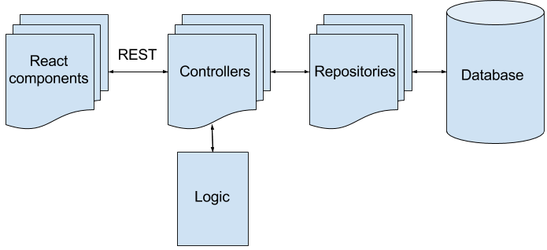

# gakusei

## About
Gakusei, which means _student_ in Japanese, is an application for learning and practicing Japanese.
The project's primary focus is to develop a tool for learning Japanese via Swedish.
Gakusei is governed by [Daigaku Sverige](http://www.daigaku.se), and sponsored by [Kits](https://www.kits.se).

A beta version of Gakusei can be tested at [gakusei.daigaku.se](http://gakusei.daigaku.se).

### Prerequisites
To build the project, it is recommended to use `npm`, a nodejs-based general command line utility, and maven (`mvn`), a command line utility for Java.

Gakusei is also dependent on a [grammar library](https://github.com/psandboge/japanese-grammar-utils) which generates inflections for verbs (among other things). In order to build the project, you must install this library in your local m2 repository. Do this by cloning or downloading it and run `mvn clean install` in its root directory.

In the instructions below, it is assumed that the aforementioned tools are available.

### Instructions
**Quick Note:** If you are just looking to make the application run ASAP, without a persistent database or anything, do `mvn package -Pproduction` (you still need java 8 and maven)

`git clone` this project (how to get git: `apt-get install git` using *nix or using [Git for Windows/Mac/Solaris/Linux](https://git-scm.com/downloads)), or just download as zip and unzip it somewhere.

#### Get the back-end running in a development environment

* You will need [Java 8](http://www.oracle.com/technetwork/java/javase/downloads/jdk8-downloads-2133151.html)

##### 2.a. Simple: Using in-memory database (H2)

1. In terminal, ```mvn spring-boot:run```

**Note:** You should also be able to just run as a Java application in your IDE of choice.

##### 2.b. Advanced: Using PostgreSQL

1. Make sure to have a fairly recent installation of PostgreSQL 9
2. In Postgres, create a user with name/password *gakusei*
3. In Postgres, create a database with the name *gakusei* with the user *gakusei* as owner (or appropriate privileges)
4. In Postgres, create a schema called *contentschema* in database *gakusei*
5. Start the back-end with ```mvn spring-boot:run -Drun.profiles=postgres``` instead of ```mvn spring-boot:run```

**Note #1:** Data initialization is set manually to true or false in application.yml. Starting the server twice with data init set to true may put redundant data in your database, so make sure to only do it once. If you need to refresh your database, you will have to wipe and delete/drop all tables as well.
**Note #2:** You should also be able to just run as a Java application in your IDE of choice, specifying `--spring.profiles.active=postgres` as argument to enable postgres.

#### Get the front-end running in a development environment

Install [nodejs](https://nodejs.org/en/), any version is fine.

1. Navigate to project directory in a terminal (eg. `cd IdeaProjects/gakusei`)
2. In terminal, write `npm install` to install all needed dependencies
3. Now you can choose to either
* Do `npm start` to open a web server at http://localhost:7777. Any changes will automatically update, so no need to run the command again.
* Do `npm run compile` to simply compile the files, and visit the back-end server on http://localhost:8080 with reduced developer convenience. For every change you make in the front-end, you will need to run the command again.

#### Package it up for deployment
Since we will create a single .jar file with all resources embedded, we will need to compile the front-end to the back-end resources first. We can use the pre-made maven profiles for this purpose.

2. Do `mvn package -Pproduction` to install npm packages, compile the front-end, back-end, and finally, package the .jar file to `target/`
3. After completing these steps, simply just copy the .jar file that contains all the embedded files, to a server of your choice.
4. Sample commands for starting the server:
* `nohup java -jar gakusei.jar &> server.log &` for in-memory db, that clears on restart.
* `nohup java -jar gakusei.jar --spring.profiles.active="postgres, enable-resource-caching" &> server.log &` for postgres, with previously mentioned setup needed.

* Command `mvn package -Pdevelopment` is also available, should you want to use it for troubleshooting.
* The spring profile "enable-resource-caching" enables some very effective caching methods. You should always want to have this profile active when you deploy in production.

### System overview
The following picture gives a brief overview of the projects structure:



#### Frontend
- React
- React Redux
- React Router
- React Bootstrap
- ~~Browserify~~ now Webpack 2!

Webpack packages everything into a bundle file (except for most resource files, they'll get merged in eventually as well), which is served via a single index.html file given either by the back-end in production (thymeleaf, inside `templates/` dir) or by the webpack dev server front-end on port 7777 (`templates/webpack_index.html`).

#### Backend
- Spring Boot
- Maven

The backend is a Spring Boot application. The frontend's REST requests are received by the controllers which handles the
request. The controllers uses modules with business logic and repositories with the database connections in order to
handle the requests and returning a response.

### Misc
In the project's Spring Boot configuration file (src/main/resources/application.yml) the data initialization and event
logging can be turned on and off. Data initialization is only for the development environment, as actual data is not shipped in this project.

Any changes to data structure is done via liquibase's changeset file. Make sure your changes are incremental (one changeset for each new change) after you've published your application somewhere, otherwise liquibase will think you've done something wrong modifying existing changesets, and will refuse to continue.
